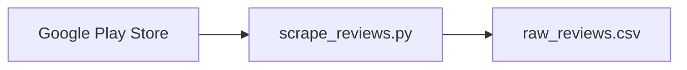
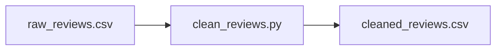

# Technical Documentation

## Code Structure

### 1. Review Scraping (`src/data/scrape_reviews.py`)

#### Main Components
- `BANK_APPS`: Dictionary mapping bank names to their Google Play Store app IDs
- `scrape_app_reviews()`: Function to scrape reviews for a specific app
- `main()`: Orchestrates the scraping process for all apps

#### Key Features
- Pagination handling
- Error handling and logging
- Rate limiting (2-second delay between requests)
- Data validation

#### Usage
```python
python src/data/scrape_reviews.py
```

#### Output
- Raw reviews saved to `data/raw/raw_reviews.csv`
- Columns: app_name, review_text, rating, date

### 2. Data Preprocessing (`src/data/clean_reviews.py`)

#### Main Components
- `load_raw_data()`: Loads raw reviews from CSV
- `remove_duplicates()`: Removes duplicate reviews
- `handle_missing_data()`: Handles missing values
- `normalize_dates()`: Standardizes date format
- `clean_text()`: Cleans and normalizes review text
- `preprocess_reviews()`: Main preprocessing function

#### Key Features
- Duplicate detection
- Missing data handling
- Date normalization
- Text cleaning
- Comprehensive logging

#### Usage
```python
python src/data/clean_reviews.py
```

#### Output
- Cleaned reviews saved to `data/processed/cleaned_reviews.csv`
- Columns: app_name, review_text, rating, date, source

### 3. Testing (`tests/test_clean_reviews.py`)

#### Test Cases
- `test_clean_text()`: Tests text cleaning function
- `test_process_reviews()`: Tests main preprocessing function

#### Coverage
- Text cleaning
- Date normalization
- Duplicate removal
- Missing data handling

## Data Flow

### 1. Data Collection


### 2. Data Preprocessing


## Error Handling

### 1. Scraping Errors
- Network timeouts
- Rate limiting
- Invalid app IDs
- Missing data

### 2. Preprocessing Errors
- Invalid date formats
- Missing required fields
- Data type mismatches
- File I/O errors

## Logging

### 1. Scraping Logs
- Number of reviews scraped
- API response status
- Error messages
- Progress updates

### 2. Preprocessing Logs
- Data loading status
- Cleaning statistics
- Error messages
- Final output status

## Dependencies

### Required Packages
```python
pandas>=2.0.0
numpy>=1.24.0
google-play-scraper>=1.2.4
requests>=2.31.0
beautifulsoup4>=4.12.0
```

### Development Dependencies
```python
pytest>=7.4.0
black>=23.7.0
flake8>=6.1.0
```

## Best Practices

### 1. Code Style
- Follow PEP 8 guidelines
- Use type hints
- Write docstrings
- Keep functions focused

### 2. Error Handling
- Use try-except blocks
- Log errors properly
- Provide meaningful messages
- Handle edge cases

### 3. Testing
- Write unit tests
- Test edge cases
- Mock external dependencies
- Maintain test coverage

## Future Improvements

### 1. Code
- Add more error handling
- Improve logging
- Add more test cases
- Optimize performance

### 2. Features
- Add more data sources
- Implement advanced analysis
- Add visualization tools
- Create API endpoints

## Troubleshooting

### Common Issues
1. Rate limiting
   - Solution: Increase delay between requests
2. Missing data
   - Solution: Check data validation
3. File permissions
   - Solution: Check directory permissions
4. Memory issues
   - Solution: Process data in chunks

### Debug Tips
1. Check logs for errors
2. Verify file paths
3. Test with small datasets
4. Monitor memory usage 